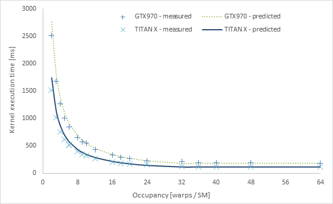
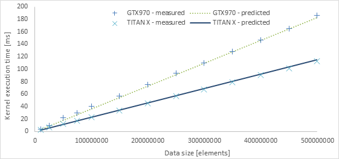
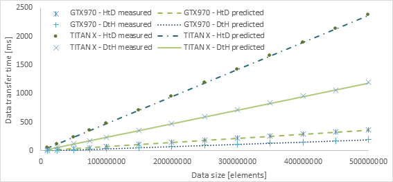
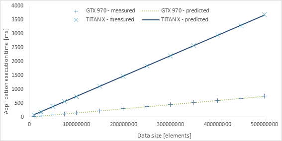

## Author
[Tomasz Gajger](https://github.com/tomix86)
## Abstract
In this work, we evaluate an analytical GPU performance model based on Little’s law, that expresses the kernel execution time in terms of latency bound, throughput bound, and achieved occupancy. We then combine it with the results of several other research papers from the field, so that the work contains all the elements needed for its parametrization, most notably the latencies of various instructions executed on the GPU. We also introduce equations for data transfer time estimation, together with required parameters and description of the methodology used to obtain them. The model was incorporated into the MERPSYS framework, which is a general-purpose simulator for parallel and distributed systems.

The resulting solution enables the user to express a CUDA application in MERPSYS editor using an extended Java language and then conveniently evaluate its performance for various launch configurations using different hardware units. An additional benefit is a possibility to exceed actual limits imposed by the hardware, e.g. amount of operating memory available on the host or the device, or the number of interconnected GPUs. The entire implementation process beginning with writing a simple CUDA kernel, its compilation and decompilation, assembly analysis, modifications of the MERPSYS framework and definition of the model within it, was meticulously documented. Additionally, since this work includes a detailed description of the usage and adjustment process of the MERPSYS platform, it may be used as a tutorial for people interested in this solution.

We also explain numerous aspects related to the GPU computing such as CUDA architecture and programming model, memory hierarchy, kernel execution process, development and analysis of CUDA applications, as well as evolution of subsequent editions of the GPUs and differences between them. Descriptions are very detailed, hence readers unfamiliar with CUDA architecture can understand it on a level allowing for a development of their own simple applications. Furthermore, we provide a systematic methodology for extracting kernel characteristics, that are used as input parameters of the model. The paper additionally contains a vast amount of information related to the analysis of CUDA applications, naming a few: kernel execution time measurement in seconds and clock cycles, enhancing the code for improved analysis under a profiler, data transfer time measurement, analysis of a machine code and kernel execution graph preparation, determining GPU processing 
power based on its architecture, estimation of the occupancy based on the source code analysis, and more.

The model was evaluated using kernels representing different traits, most importantly varying computations to communication ratio, where by communication time we refer to accesses to the GPU’s global memory. We also used a large variety of launch configurations. We found the model to be very accurate for computation bound kernels and realistic workloads, whilst for memory throughput bound kernels and degenerated scenarios the results were not as good, but still within acceptable limits. We have also proven its portability between two devices of the same hardware architecture but different processing power.

**Keywords**: GPU performance modeling, GPGPU, MERPSYS, CUDA, parallel processing, high performance computing.

## Results
The tests were performed using two testbeds, one with GTX 970 and PCIe v3.1 16x, and the second with GTX TITAN X (Maxwell edition) and PCIe v2.0 4x. The model was calibrated for the former setup. The devices differ in number of SMs, SM clock and in terms of memory system, with GTX TITAN X having wider memory bus, the differences and similarities are summarized in the table down below.

Below a sample of the results is presented. Figure 1 shows the behavior of the model for a test scenario with varying occupancy. Figures 2-4 show how the kernel execution and data transfer times are modeled when the input data size changes. For a detailed description, see the [master's thesis](Modeling-parallel-processing-with-GPU-and-verification-using-the-MERPSYS-platform.pdf).

|                                                         |    GTX 970        |    GTX   TITAN X (Maxwell)    |
|---------------------------------------------------------|-------------------|-------------------------------|
|    SMs                                                  |    13             |    24                         |
|    SM   clock [MHz]                                     |    1253           |    1076                       |
|    Compute   capability                                 |    5.2            |    5.2                        |
|    Warp   size                                          |    32             |    32                         |
|    Schedulers                                           |    4              |    4                          |
|    CUDA   cores                                         |    128            |    128                        |
|    Memory   clock [MHz]                                 |    1753           |    1753                       |
|    Bus   width [bits]                                   |    256            |    384                        |

\

\
_Fig 1. Measured and predicted kernel execution time in function of occupancy for both devices_

\
_Fig 2. Measured and predicted kernel execution time for large data sizes on both devices_

\
_Fig 3. Measured and predicted data transfer times for large data sizes for both testbeds_

\
_Fig 4. Measured and predicted application execution times for large data sizes for both testbeds_

## Acknowledgements
I'd like to thank Mr. Vasily Volkov, whose PhD dissertation was of tremendous help when working on this thesis. It should be further noted that the performance model used in this work is an adaptation and extension of the model proposed in Mr. Volkov's dissertation, that is [available here](https://www2.eecs.berkeley.edu/Pubs/TechRpts/2016/EECS-2016-143.html).

Additionally, I'd like to thank my thesis supervisor, Paweł Czarnul, PhD DSc for his valuable insights, guidance and meticulous review of this work.
